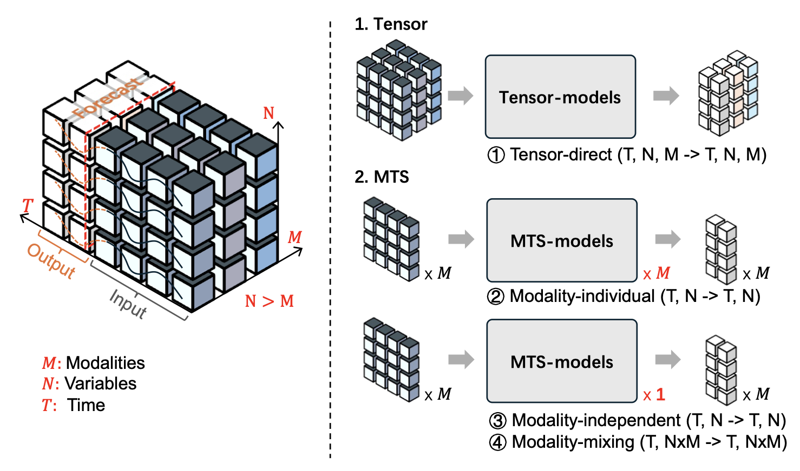

# Tensor-Time-Series-Library
[](https://awesome.re) 
[](https://github.com/zhangzw16/Tensor-Time-Series)
[](https://github.com/zhangzw16/Tensor-Time-Series)


Papers and datasets for tensor time series.

## Papers with Code

- `TTS-Norm` TTS-Norm: Forecasting Tensor Time Series via Multi-Way Normalization (ACM TKDD 2023) [[paper](https://dl.acm.org/doi/10.1145/3605894)] [[code](https://github.com/beginner-sketch/TTSNorm)]
- `GMRL` Learning Gaussian Mixture Representations for Tensor Time Series Forecasting (IJCAI 2023) [[paper](https://www.ijcai.org/proceedings/2023/0231.pdf)] [[code](https://github.com/beginner-sketch/GMRL)]
- `NET3` Network of Tensor Time Series (WWW 2021) [[paper](https://arxiv.org/abs/2102.07736)] [[code](https://github.com/baoyujing/NET3)]
- `STC-GNN` Spatio-Temporal-Categorical Graph Neural Networks for Fine-Grained Multi-Incident Co-Prediction (CIKM 2021) [[paper](https://dl.acm.org/doi/abs/10.1145/3459637.3482482)] [[code](https://github.com/underdoc-wang/STC-GNN)]
- `DMSTGCN` Dynamic and multi-faceted spatiotemporal deep learning for traffic speed forecasting (KDD 2021) [[paper](https://dl.acm.org/doi/10.1145/3447548.3467275)] [[code](https://github.com/liangzhehan/DMSTGCN/tree/main)]
Here is the list of papers organized in the requested format:
- `ST-Norm` Spatial and temporal normalization for multi-variate time series forecasting (KDD 2021) [[paper](https://dl.acm.org/doi/10.1145/3447548.3467330)] [[code](https://github.com/JLDeng/ST-Norm)]
- `ReGENN` Pay Attention to Evolution: Time Series Forecasting with Deep Graph-Evolution Learning (TPAMI 2020) [[paper](https://ieeexplore.ieee.org/document/9416768)] [[code](https://github.com/gabrielspadon/ReGENN)]  
- `MTGNN` Connecting the Dots: Multivariate Time Series Forecasting with Graph Neural Networks (NeurIPS 2020) [[paper](https://arxiv.org/abs/2005.11650)] [[code](https://github.com/nnzhan/MTGNN)]
- `AGCRN` Adaptive Graph Convolutional Recurrent Network for Traffic Forecasting (NeurIPS 2020) [[paper](https://proceedings.neurips.cc/paper/2020/file/ce1aad92b939420fc17005e5461e6f48-Paper.pdf)] [[code]()]
- `StemGNN` Spectral temporal graph neural network for multivariate time-series forecasting (NeurIPS 2020) [[paper](https://arxiv.org/abs/2103.07719)] [[code](https://github.com/microsoft/StemGNN)]
- `STTran` Hierarchically structured transformer networks for fine-grained spatial event forecasting (WWW 2020) [[paper](https://dl.acm.org/doi/10.1145/3366423.3380296)] 
- `CoST-Net` Co-Prediction of Multiple Transportation Demands Based on Deep Spatio-Temporal Neural Network (KDD 2019) [[paper](https://dl.acm.org/doi/10.1145/3292500.3330887)] 
- `MiST`: A Multiview and Multimodal Spatial-Temporal Learning Framework for Citywide Abnormal Event Forecasting (WWW 2019) [[paper](https://dl.acm.org/doi/10.1145/3308558.3313730)] 
- `Graph Wavenet` Graph WaveNet for Deep Spatial-Temporal Graph Modeling (IJCAI 2019) [[paper](https://arxiv.org/abs/1906.00121)] [[code](https://github.com/nnzhan/Graph-WaveNet)]
- `DCRNN` Diffusion Convolutional Recurrent Neural Network: Data-Driven Traffic Forecasting (ICLR 2018) [[paper](https://arxiv.org/abs/1707.01926)] [[code](https://github.com/liyaguang/DCRNN)]
- `STGCN` Spatio-Temporal Graph Convolutional Networks: A Deep Learning Framework for Traffic Forecasting (IJCAI 2018) [[paper](https://arxiv.org/abs/1709.04875)] [[code](https://github.com/VeritasYin/STGCN_IJCAI-18)]
- `MLDS` Multilinear dynamical systems for tensor time series (NeurIPS 2013) [[paper](https://people.eecs.berkeley.edu/~russell/papers/nips13-tensor.pdf)] [[code](https://github.com/lileicc/mlds)]
- `DynaMMo` DynaMMo: mining and summarization of coevolving sequences with missing values (KDD 2009) [[paper](https://dl.acm.org/doi/10.1145/1557019.1557078)] [[code](https://github.com/lileicc/dynammo)]


## Datasets

For datasets, please refer to [Datasets](./datasets/README.md)

## Forecast Paradigms
<!-- insert imgs -->


## Get Started

Create a virtual environment before we get stated. (Python >= 3.8)

```shell
conda create --name TensorTSL
```

An easy way to install the environment is to use `pip install` with the config file `pyproject.toml`. 

```shell
pip install .
```


## Run

Run a simple task.

```shell
python3 main.py
```
There have been some tasks already. You can try to run `python3 run_tasks.py --help` for help.

Tasks: 
+ MTS_Task: run models in `MTS_ModelList` with specific datasets and `data_mode`.
```shell
# for example
python3 run_tasks.py --his_len 96 --pred_len 12 --dataset Finance --task_name MTS_Task --output_dir './output/'
```
+ TTS_Task: run models in `TTS_ModelList` with specific datasets and `data_mode`. (GNN is initialized with 'pearson')
```shell
# for example
python3 run_tasks.py --his_len 96 --pred_len 12 --dataset Finance --task_name TTS_Task --output_dir './output/'
```

+ Graph_Init_Task: run Models with prior graph with different graph initialization.
```shell
# for example
python3 run_tasks.py --his_len 96 --pred_len 12 --dataset Finance --task_name MTS_Task --output_dir './output/' --graph_init random
```

## Develop

Due to its modular design, developing with our framework is straightforward and efficient.

### Add new models

In our framework, there are two types of models: `TensorModel` and `MultiVarModel`. These models are categorized based on the shape of the input data. 
- `TensorModel` supports data inputs with the shape (time, dim1, dim2)
-  `MultiVarModel` supports data input with the shape (time, dim)
